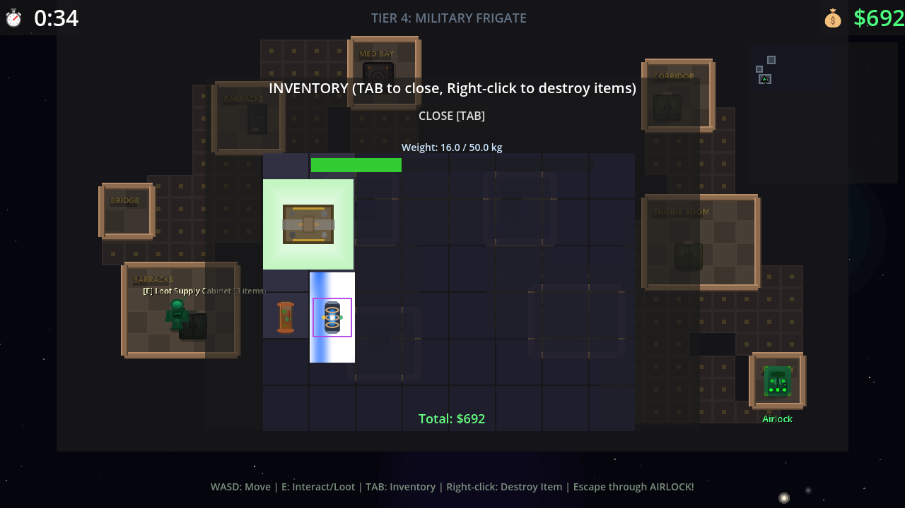

# Cargo Escape - Game Systems Status

**Last Updated:** February 2026  
**Purpose:** This document describes what systems are ACTUALLY implemented in the game vs documentation/planned features.

---

## 🎮 GAME OVERVIEW

Cargo Escape is a two-phase space game:
1. **Boarding Phase** - Top-down looting gameplay on procedurally generated ships
2. **Escape Phase** - Side-scrolling space flight avoiding enemies/obstacles

### Main Game Loop
```
Intro (Main Menu)
    ↓ "New Game"
Boarding Phase (Loot ships, timer-based)
    ↓ Escape through airlock or timer expires
Undocking Cutscene
    ↓
Escape Phase (Side-scroller, reach hideout)
    ↓ Reach destination
Hideout (Sell loot, manage stash, upgrades)
    ↓ "Depart"
Loop back to Boarding
```

---

## ✅ FULLY IMPLEMENTED SYSTEMS

### Core Infrastructure

| System | Script | Description |
|--------|--------|-------------|
| **GameManager** | `scripts/game_manager.gd` | State management, health, upgrades, modules, credits, dual inventory |
| **SaveManager** | `scripts/save_manager.gd` | Tutorial tracking, settings persistence |
| **AudioManager** | `scripts/audio_manager.gd` | SFX pooling, volume control |
| **ObjectPool** | `scripts/object_pool.gd` | Generic object pooling for performance |
| **LoadingScreen** | `scripts/ui/loading_screen.gd` | Progress bar, tips, fade transitions |
| **CutsceneManager** | `scripts/ui/cutscene_manager.gd` | Skip controls, fast forward |
| **PopupManager** | `scripts/popup_manager.gd` | Achievement notifications |

### Boarding Phase (Looting)

| System | Script | Description |
|--------|--------|-------------|
| **BoardingManager** | `scripts/boarding/boarding_manager.gd` | Main looting gameplay controller |
| **BoardingPlayer** | `scripts/boarding/boarding_player.gd` | Top-down movement, interaction |
| **ShipGenerator** | `scripts/boarding/ship_generator.gd` | Procedural ship layouts |
| **ShipInteriorRenderer** | `scripts/boarding/ship_interior_renderer.gd` | Renders procedural interiors |
| **SearchSystem** | `scripts/boarding/search_system.gd` | Container searching mechanic |
| **MinimapRenderer** | `scripts/boarding/minimap_renderer.gd` | In-game minimap |
| **EscapeCutscene** | `scripts/boarding/escape_cutscene.gd` | Escape from ship animation |
| **LootMenu** | `scripts/boarding/loot_menu.gd` | Drag-and-drop looting interface |

### Loot/Inventory System

| System | Script | Description |
|--------|--------|-------------|
| **ItemDatabase** | `scripts/loot/item_database.gd` | Complete item definitions (~200 items) |
| **GridInventory** | `scripts/loot/inventory.gd` | Grid-based inventory, weight system, keyboard shortcuts |
| **LootItem** | `scripts/loot/loot_item.gd` | Draggable item with visual states |
| **ItemData** | `scripts/loot/item_data.gd` | Item resource structure |
| **Container** | `scripts/loot/container.gd` | Lootable containers |
| **ItemVisuals** | `scripts/loot/item_visuals.gd` | Procedural item rendering |

### Escape Phase (Side-Scroller)

| System | Script | Description |
|--------|--------|-------------|
| **Main Scene** | `scripts/main.gd` | Escape gameplay, spawning, scrolling |
| **Player** | `scripts/player.gd` | Physics flight, Newtonian movement |
| **Enemy** | `scripts/enemy.gd` | Multiple movement patterns, health |
| **Laser** | `scripts/laser.gd` | Projectile system |
| **Asteroid** | `scripts/background/asteroid.gd` | Obstacle |
| **EnemySpawner** | `scripts/enemies/enemy_spawner.gd` | Spawning logic |

### AI System (Behavior Trees)

| System | Script | Description |
|--------|--------|-------------|
| **BehaviorTree** | `scripts/ai/behavior_tree.gd` | Complete BT framework |
| **BT Nodes** | `scripts/ai/bt_*.gd` | 15+ node types: Selector, Sequence, Patrol, Chase, Attack, Flee, etc. |
| **BTBuilder** | `scripts/ai/bt_builder.gd` | Fluent API for building trees |

### UI Systems

| System | Script | Description |
|--------|--------|-------------|
| **HUD** | `scripts/ui/hud.gd` | Health bar, score, speed, progress |
| **PauseMenu** | `scripts/ui/pause_menu.gd` | Pause/resume, settings, quit |
| **MainMenu** | `scripts/ui/main_menu.gd` | Start game, settings |
| **GameOverScreen** | `scripts/ui/game_over_screen.gd` | Death/completion |
| **SettingsMenu** | `scripts/ui/settings_menu.gd` | Volume, display |
| **AccessibilityMenu** | `scripts/ui/accessibility_menu.gd` | Accessibility options |
| **ControlsMenu** | `scripts/ui/controls_menu.gd` | Key rebinding |

### Accessibility

| System | Script | Description |
|--------|--------|-------------|
| **AccessibilityManager** | `scripts/ui/accessibility_manager.gd` | Colorblind modes (3 types), high contrast, text size, reduce motion |
| **ColorblindShader** | `shaders/colorblind_filter.gdshader` | Color transformation |
| **ColorblindOverlay** | `scripts/ui/colorblind_overlay.gd` | Applies shader |

### Achievements

| System | Script | Description |
|--------|--------|-------------|
| **AchievementManager** | `scripts/achievement_manager.gd` | 6 achievements tracked |
| **AchievementPopup** | `scripts/ui/achievement_popup.gd` | Unlock notifications |
| **AchievementGallery** | `scripts/ui/achievement_gallery.gd` | View achievements |

### Tutorial

| System | Script | Description |
|--------|--------|-------------|
| **TutorialManager** | `scripts/tutorial/tutorial_manager.gd` | 6-step tutorial |
| **TutorialOverlay** | `scripts/tutorial/tutorial_overlay.gd` | UI overlay |

### Scene Transitions

| System | Script | Description |
|--------|--------|-------------|
| **IntroManager** | `scripts/intro/intro_manager.gd` | Animated main menu |
| **IntroSequence** | `scripts/intro/intro_sequence.gd` | Story intro |
| **UndockingManager** | `scripts/undocking/undocking_manager.gd` | Undocking animation |
| **HideoutManager** | `scripts/hideout/hideout_manager.gd` | Docking, stash, market, upgrades |

### Data Definitions

| System | Script | Description |
|--------|--------|-------------|
| **Factions** | `scripts/loot/factions.gd` | 5 factions with loot modifiers |
| **ShipTypes** | `scripts/boarding/ship_types.gd` | 5 ship tiers |
| **RoomTypes** | `scripts/boarding/room_types.gd` | Room definitions |
| **ContainerTypes** | `scripts/boarding/container_types.gd` | Container types |

---

## ⚠️ PARTIALLY IMPLEMENTED

| System | Status | Notes |
|--------|--------|-------|
| **Audio Assets** | System ready | AudioManager works, but many SFX files may be missing |
| **Module System** | Structure exists | Only `basic_laser.tres` defined, limited variety |
| **Market Buying** | UI exists | Selling works, buying may not be complete |
| **Enemy Weapons** | Limited | Enemies don't shoot back in escape phase |

---

## ❌ NOT IMPLEMENTED

| Feature | Status |
|---------|--------|
| **Full Save/Load** | Only settings/tutorial saved, no mid-game saves |
| **Background Music** | No music system |
| **Multiple Weapons** | Single laser only |
| **Ship Upgrades** | UI exists, functionality incomplete |
| **Boss Fights** | Not implemented |
| **Story Progression** | Single gameplay loop, no narrative arc |

---

## 📁 REGISTERED AUTOLOADS

All of these are loaded at game start and globally accessible:

1. `GameManager` - Game state, credits, health
2. `CutsceneManager` - Cutscene playback
3. `AudioManager` - Sound effects
4. `ObjectPool` - Object pooling
5. `SaveManager` - Save/load
6. `TutorialManager` - Tutorial state
7. `AchievementManager` - Achievement tracking
8. `PopupManager` - Popup notifications
9. `AccessibilityManager` - Accessibility features
10. `LoadingScreen` - Loading transitions

---

## 📊 IMPLEMENTATION COMPLETENESS

| Category | Completion | Notes |
|----------|------------|-------|
| Core Game Loop | 95% | Both phases playable |
| Player Controls | 100% | Both ship types controllable |
| Enemy AI | 80% | Patterns work, BT system ready |
| Loot System | 100% | Full item database, inventory |
| Procedural Ships | 100% | Ship generator working |
| UI/Menus | 95% | All menus functional |
| Save/Load | 60% | Settings only, no game saves |
| Achievements | 90% | 6 achievements working |
| Accessibility | 100% | All features working |
| Audio | 30% | System ready, assets missing |
| Visual Polish | 70% | Transitions working |

---

## 🗑️ DOCUMENTATION FILES TO REVIEW

These `.md` files in the project root describe systems - cross-reference with above:

| File | Matches Code? |
|------|---------------|
| `ACHIEVEMENT_SYSTEM.md` | ✅ Yes |
| `AI_BEHAVIOR_TREES.md` | ✅ Yes |
| `BOARDING_SYSTEM_DESIGN.md` | ✅ Yes |
| `LOOT_SYSTEM_DOCS.md` | ✅ Yes |
| `MINIMAP_DOCUMENTATION.md` | ✅ Yes |
| `PAUSE_MENU_DOCS.md` | ✅ Yes |
| `SAVE_SYSTEM_DOCS.md` | ⚠️ Partial (settings only) |
| `SOUND_SYSTEM_DOCS.md` | ⚠️ System exists, assets partial |
| `TUTORIAL_SYSTEM_DOCS.md` | ✅ Yes |
| `SHIP_GENERATION_DESIGN.md` | ✅ Yes |
| `ITEM_DATABASE_IMPLEMENTATION.md` | ✅ Yes |
| `OBJECT_POOL_DOCS.md` | ✅ Yes |
| `ACCESSIBILITY.md` | ✅ Yes |
| `RARITY_EFFECTS.md` | ⚠️ Partial |
| `FACTION_ITEMS.md` | ✅ Yes |

---

## 🎯 CONTROLS

### Boarding Phase
- **WASD** - Move
- **E** - Interact / Search containers
- **TAB** - Open inventory
- **ESC** - Close menus / Pause
- **Right-click** - Destroy item in inventory

### Escape Phase
- **WASD / Arrow Keys** - Fly ship
- **Space** - Fire weapons
- **ESC** - Pause

### Inventory
- **Drag & Drop** - Move items between container and inventory
- **1-9** - Quick access slots
- **Q** - Drop selected item
